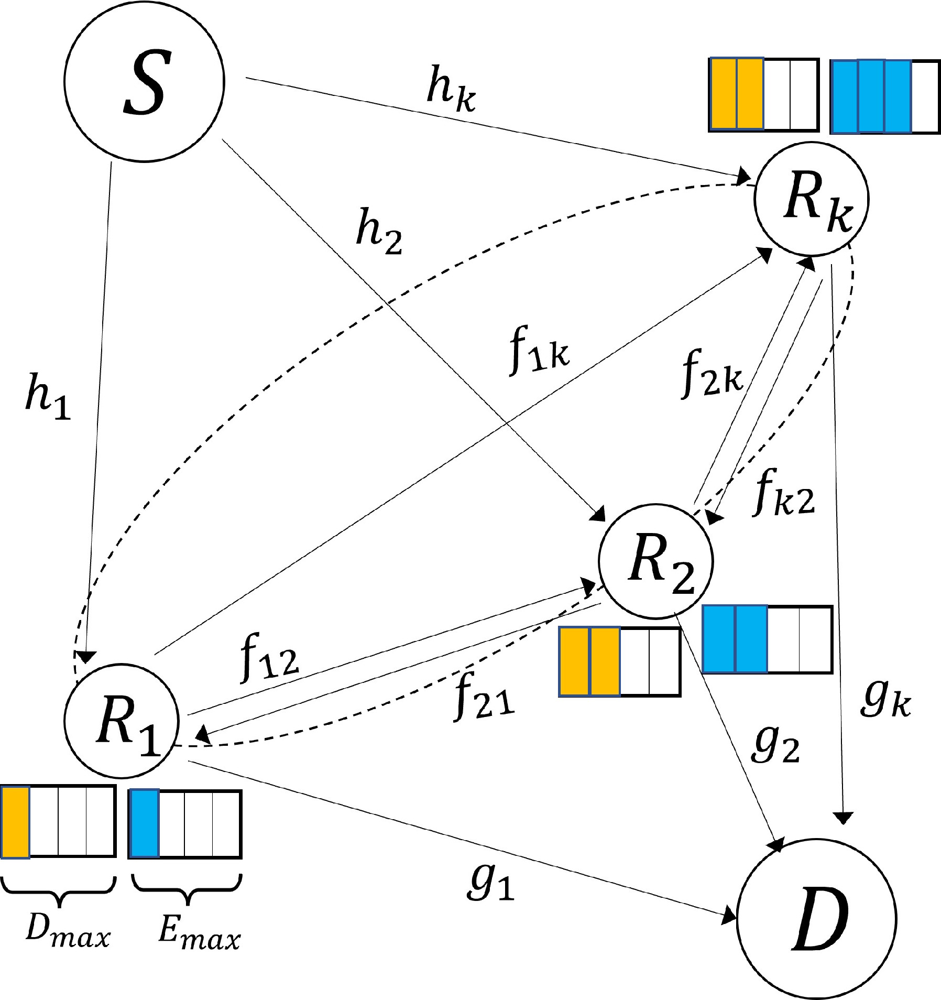

# Relay Selection based on Deep Q Network(DQN)

## 1. system model
A two-hop communication scenario, representing as Figure 1, comprising of K relay nodes is performed in this simulation. The symbol S represents source, while D represents destination. The data packet should transmit by the intermediate relays R1~Rk , which means the direct signal from source to destination is ignored. Besides, hk and gk denote the channel coefficients of 𝑆−𝑅k and 𝑅k−𝐷 links, respectively, and fij is represented the channel coefficients between any two different relays Ri and Rj. All channel coefficients, namely hk, gk, fij, are assumed as i.i.d zero-mean complex Gaussian distribution. The figure is presented as follows.

In our work, each relay maintains two finite buffers, including a data buffer, which can keep at most Dmax data packets, and an energy buffer, whose maximum storage is Emax intervals. An interval in the energy buffer corresponds to the amount of energy consumed to transmit one data packet, which has a fixed length.
<p align="center">
    
</p>
<p style="text-align: center">Figure 1</p>

## 2. How to run the code?
```
# open cmd on your laptop
git clone https://github.com/Sinyu104/Relay-Selection-based-on-DQN.git
# go to the file of cloing
python dqn.py
```
